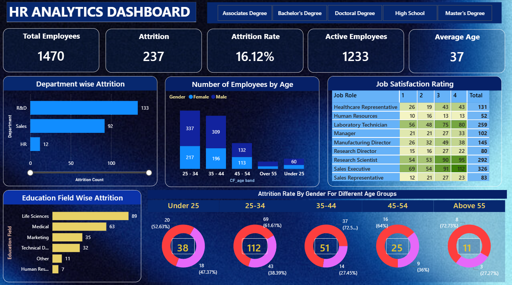

# 📊 HR Analytics Dashboard — Power BI

An interactive Power BI dashboard developed to analyze employee attrition patterns and workforce demographics. The dashboard provides insights into employee turnover, job satisfaction, age distribution, and educational backgrounds to support data-driven HR decision-making.

---

## 📌 Overview

Employee attrition is a critical challenge that affects organizational productivity and workforce stability. This project aims to uncover patterns behind employee turnover and transform raw HR data into actionable business insights.

The dashboard enables HR teams and decision-makers to:

* Identify departments with higher attrition.
* Analyze workforce demographics across age groups.
* Understand job satisfaction trends across roles.
* Examine attrition patterns by educational background.
* Support employee retention strategies through data.

---

## 📊 Key Performance Indicators (KPIs)

| KPI              | Value    |
| ---------------- | -------- |
| Total Employees  | 1,470    |
| Active Employees | 1,233    |
| Attrition Count  | 237      |
| Attrition Rate   | 16.12%   |
| Average Age      | 37 Years |

---

## 🗂️ Repository Structure

```text
hr-analytics-powerbi-dashboard/
│
├── assets/
│   └── HR_Analytics_Dashboard_overview.png
│
├── data/
│   └── HR_Analytics.csv
│
├── docs/
│   └── DAX_Measures.md
│
├── HR_Analytics_Dashboard.pbix
├── .gitignore
└── README.md
```

---

## 📁 Dataset

The dataset contains employee information used to analyze workforce trends and attrition.

### Key Columns

| Column          | Description                                    |
| --------------- | ---------------------------------------------- |
| Age             | Employee age                                   |
| Attrition       | Indicates whether an employee left the company |
| Department      | Employee department                            |
| Gender          | Employee gender                                |
| EducationField  | Educational background                         |
| JobRole         | Employee designation                           |
| JobSatisfaction | Satisfaction rating (1–4)                      |
| MonthlyIncome   | Monthly salary                                 |
| YearsAtCompany  | Number of years spent in the company           |

---

## 🛠️ Tools & Technologies

| Tool             | Purpose                        |
| ---------------- | ------------------------------ |
| Power BI Desktop | Dashboard Development          |
| Power Query      | Data Cleaning & Transformation |
| DAX              | KPI Calculations               |
| Data Modeling    | Relationship Management        |
| Excel / CSV      | Source Dataset                 |

---

## 📐 Dashboard Components

### KPI Cards

* Total Employees
* Active Employees
* Attrition Count
* Attrition Rate
* Average Age

### Attrition by Department

Analyzes employee turnover across departments to identify areas with higher attrition.

### Employee Distribution by Age

Shows workforce distribution across age groups and gender.

### Job Satisfaction Matrix

Displays satisfaction ratings across different job roles.

### Attrition by Education Field

Highlights attrition patterns based on educational backgrounds.

### Attrition by Gender Across Age Groups

Compares attrition patterns between male and female employees across different age categories.

---

## 🧮 DAX Measures

```DAX
Employee Count =
COUNT(Employee[EmployeeNumber])

Attrition Count =
CALCULATE(
    [Employee Count],
    Employee[Attrition] = "Yes"
)

Attrition Rate =
DIVIDE([Attrition Count], [Employee Count], 0)

Active Employees =
[Employee Count] - [Attrition Count]

Average Age =
AVERAGE(Employee[Age])
```

---

## 🔍 Key Insights

* Research & Development experienced the highest employee attrition.
* Employees aged 25–34 formed the largest workforce segment.
* Life Sciences and Medical backgrounds showed relatively higher attrition.
* Job satisfaction varied across different job roles.
* Overall employee attrition rate stood at **16.12%**.

---

## 🎯 Business Objective

The objective of this project is to analyze employee attrition patterns and provide insights that can help organizations improve employee retention and workforce planning.

---

## 📷 Dashboard Preview

<p align="center">
  
</p>

---

## 🚀 Skills Demonstrated

* Data Cleaning and Transformation
* Data Modeling
* DAX Calculations
* KPI Development
* Business Intelligence
* Interactive Dashboard Design
* Analytical Storytelling

---

## 📄 License

This project is licensed under the MIT License.

---

## 🙏 Acknowledgements

* IBM HR Analytics Employee Attrition Dataset
* Microsoft Power BI

Built with ❤️ using Power BI.

